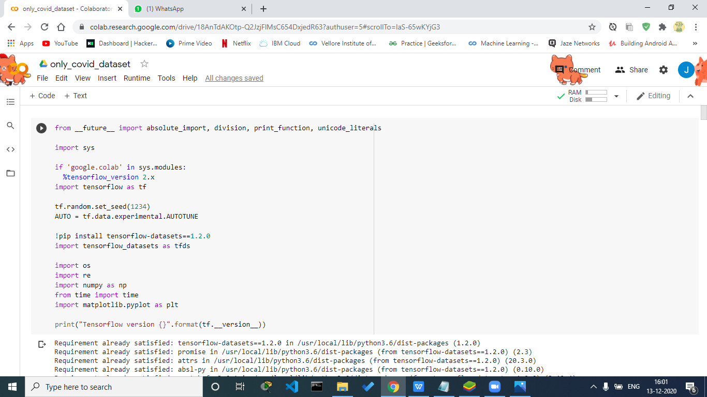
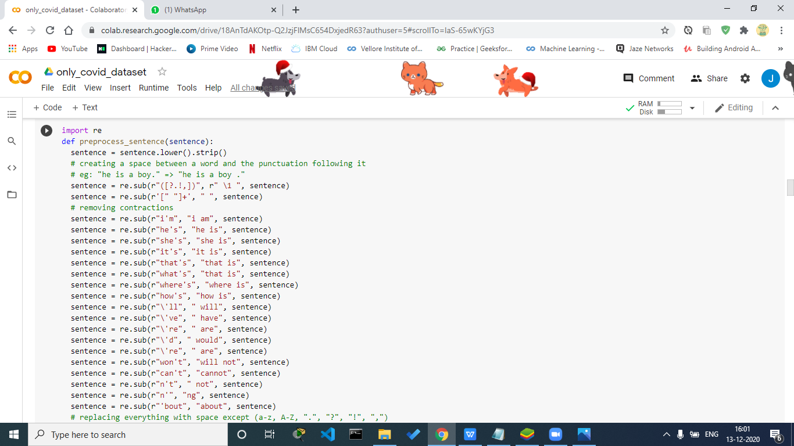
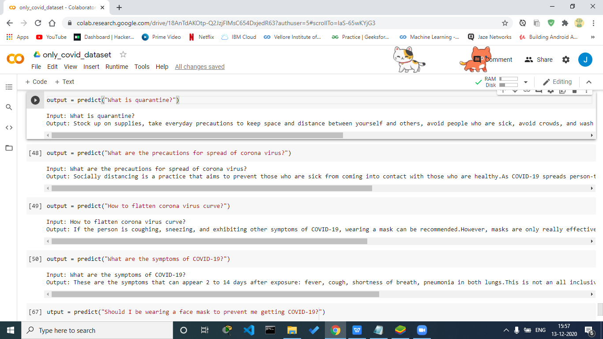
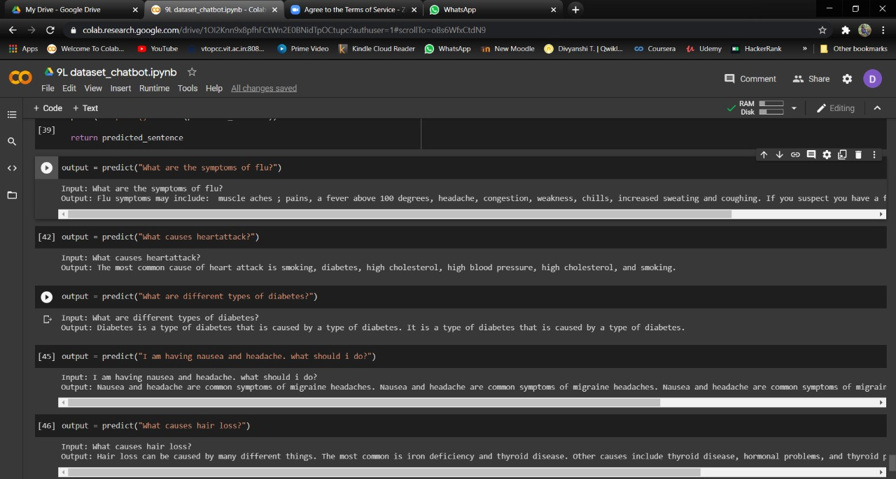
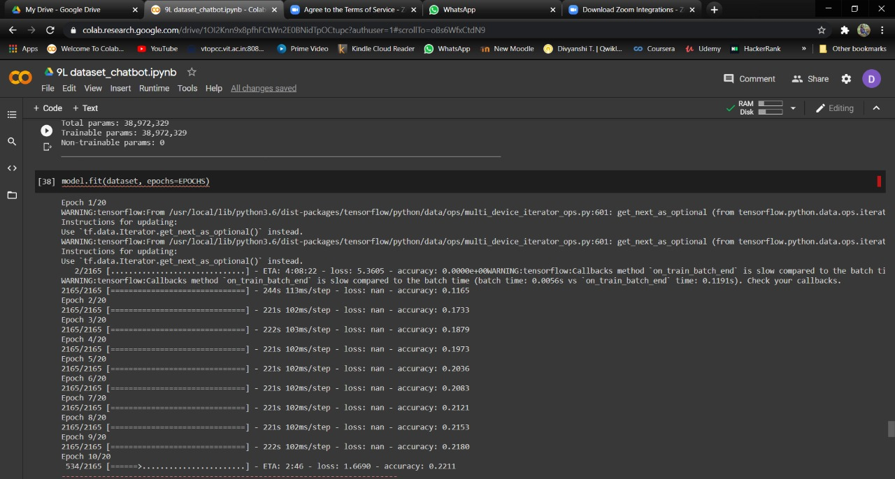
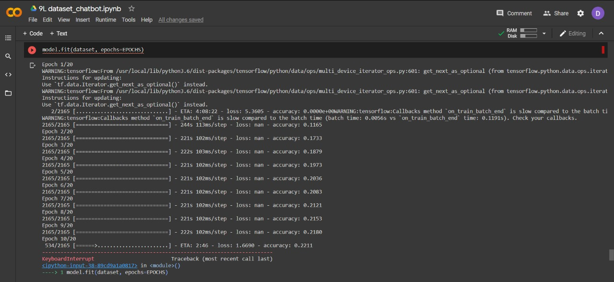

This is chatbot created during the Hackoff v3.0 for the problem statement given by Siemens

# ChatBot-Using-Transformer

A Medical Question Answering chatbot using the Tranformer technology. This repository contains two transformer models; one trained on a small covid dataset (25k records) and one trained on a larger dataset (0.9 million records) containing these topics:

'viral infection', 'vitamins', 'weigh', 'weight gain', 'vaccines', 'weight loss', 'burn', 'burning sensation', 'cancer', 'chest', 'chest pain', 'cold', 'cold sore', 'concussion', 'ct scan', 'cure', 'depression', 'diabetes', 'diagnostic test', 'diets', 'drugs', 'ear infection', 'effect', 'exercise', 'eye', 'eyes', 'face', 'feet', 'fever', 'flu', 'foot pain', 'fungal infection', 'genetic disorder', 'hair', 'hand', 'headache', 'hearing loss', 'heart', 'heart attack', 'heart disease', 'heart failure', 'heart palpitation', 'heart rate', 'heat rash', 'hepatitis', 'high cholesterol', 'hiv aids', 'hormones', 'infections', 'joint pain', 'kidney', 'knee', 'leg', 'leg pain', 'life', 'liver', 'lung', 'nutrition', 'overall health', 'stomach pain', 'stool', 'stress', 'symptoms', 'teeth', 'throat', 'tonsil', 'treatment', 'tumor', 'overeating', 'pain', 'recovery', 'skin', 'spots', 'bodily pain', 'body', 'body ache', 'body fat', 'body temperature', 'bone marrow', 'bowel movement', 'brain tumor', 'breast', 'ankle', 'anxiety disorder', 'arthritis', 'asthma', 'bacterial infection', 'birth defect', 'blood', 'blood pressure', 'blood sugar', 'blood test', 'blood urea nitrogen', 'allergy type', 'anesthesia', 'big toe', 'blood cell', 'blood clot', 'alcohol', 'allergies', 'allergic reaction', 'allergy definition', 'adhd', 'adrenaline rush', 'alcohol withdrawal', 'acne', 'physical therapy', 'poison', 'prevention', 'psychological disorders', 'shoulder', 'sickness', 'sleep', 'smoking', 'spine', 'stomach'

The dataset contains question and answer pairs stored in json format.It was gathered from various sources on the interenet and the unneccessary columns were removed.Exatractive summarization was used for shortening the very long answers and preprocessing of the dataset was done to remove unneccessary tokens.
An accuracy of 0.66 was achieved on the small covid dataset and 0.221 on the bigger dataset. The hyperparameters need to be tweaked according to the size and type of the dataset. After many trial and errors we can reach ideal hyperparameter values that give good accuracy and output. Kindly do trial and error to run this model on your own dataset. Smalller datasets are recommended to have a smaller batch_size.

Google colab was used to run the models.Download the dataset to drive and make it sharebale to all with link. Change the id variable to the one present in link.Run the cells of the .ipynb.

The link to the big dataset:https://drive.google.com/file/d/1rrqbtyxQTTbuONa3_ORMmR6e8YIedOuD/view

<h1>Covid ChatBot</h1>

<h1>Big ChatBot</h1>

